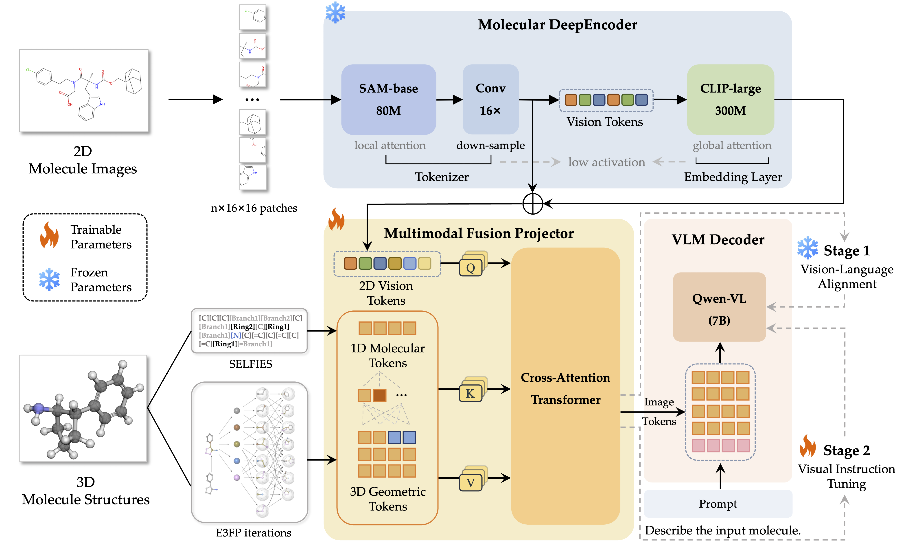
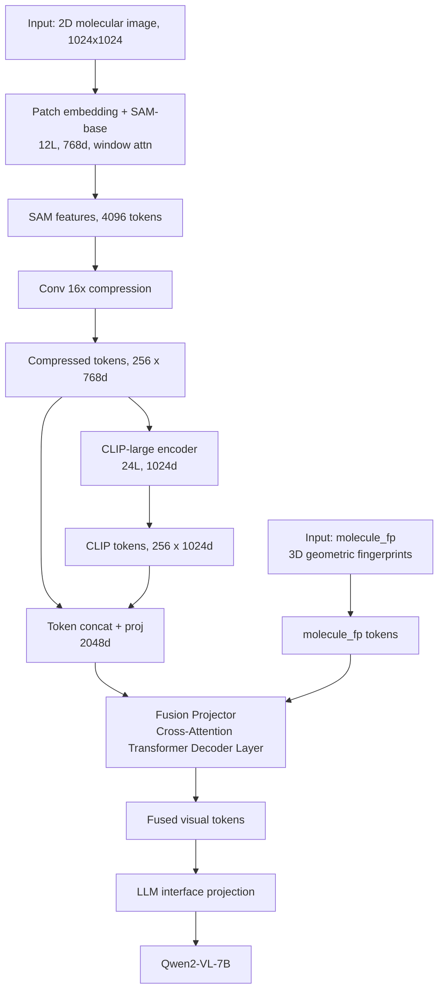
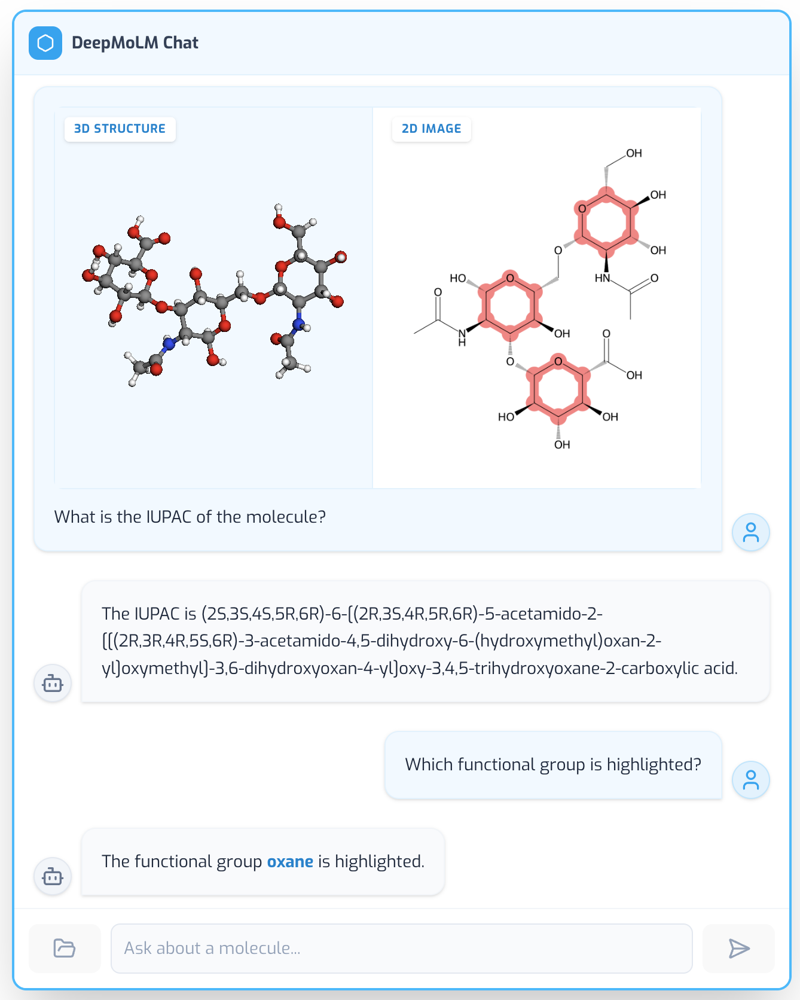

# DeepMoLM: Leveraging Visual and Geometric Structural Information for Molecule-Text Modeling

## Overview

**DeepMoLM** is a multi-modal large language model designed for comprehensive molecular understanding through the fusion of high-resolution 2D visual encodings and 3D geometric fingerprints. Unlike traditional approaches that represent molecules as simple 1D strings (SMILES) or 2D graphs, DeepMoLM employs a **DeepEncoder** for fine-grained visual perception and a **Fusion Projector** that leverages cross-attention mechanisms over `molecule_fp` (3D fingerprint) structural data to achieve stereoscopic molecular comprehension.

## Architecture

DeepMoLM integrates the visual perception capabilities of **DeepOCR** with a specialized **Fusion Projector** designed for advanced molecular understanding.





```
🏗️ Architecture
┌─────────────────────────────────────────────────────┐
│                   DeepMoLM                          │
├─────────────────────────────────────────────────────┤
│                                                     │
│  ┌─────────────────────────────────────────────┐    │
│  │           DeepEncoder (380M)                │    │
│  │                                             │    │
│  │  ┌──────────────┐   ┌─────────┐   ┌────────┐│    │
│  │  │  SAM-base    │──→│ Conv    │──→│ CLIP   ││    │
│  │  │  (80M)       │   │ 16×     │   │ (300M) ││    │
│  │  │ Window Attn  │   │Compress │   │ Global ││    │
│  │  └──────────────┘   └─────────┘   └────────┘│    │
│  │                     ↓                       │    │
│  │             [Concatenation] (256 tokens)    │    │
│  └─────────────────────┬───────────────────────┘    │
│                        │                            │
│  ┌──────────────┐       ↓                           │
│  │ molecule_fp  │──→ ┌───────────────────────────┐  │
│  │    (3D)      │    │       Fusion Projector    │  │
│  └──────────────┘    │ (Image <-> molecule_fp)   │  │
│                      └───────────────────────────┘  │
│                        ↓                            │
│  ┌─────────────────────────────────────────────┐    │
│  │               Qwen2-VL-7B                   │    │
│  └─────────────────────────────────────────────┘    │
│                                                     │
└─────────────────────────────────────────────────────┘
```

### 1. DeepEncoder (Visual Perception)

We adopt the **DeepEncoder** architecture from DeepOCR (380M parameters) to efficiently process high-resolution molecular images (1024×1024 pixels).

*   **Components**:
    *   **SAM-base** (80M): 12 transformer layers, 768-dimensional embeddings, utilizing windowed attention for efficient local feature extraction
    *   **CLIP-large** (300M): 24 transformer layers, 1024-dimensional embeddings, providing global semantic understanding
    *   **Conv 16×**: A compression module that reduces SAM feature dimensionality by a factor of 16

*   **Token Flow**:
    ```
    Input (1024×1024) → SAM (4096 tokens) → Conv16× (256 tokens)
    CLIP (256 tokens) → Concatenation → 2048-dimensional features
    ```

### 2. Fusion Projector

Unlike DeepOCR, which employs a simple linear projector for text processing, DeepMoLM utilizes a **Fusion Projector** to directly integrate 2D visual and 3D geometric modalities.

*   **Inputs**:
    *   **DeepEncoder Features**: 256 visual tokens from the 2D molecular image
    *   **molecule_fp Fingerprints**: 3D geometric fingerprint tokens

*   **Fusion Mechanism**: Cross-attention transformer decoder layer that attends image tokens to `molecule_fp` tokens, enabling effective multimodal integration

*   **Output**: Fused visual tokens at the LLM's hidden dimension, ready for downstream processing

### 3. LLM Interface

The fused multimodal tokens are projected into the **Qwen2-VL-7B** embedding space, enabling the generation of comprehensive molecular descriptions and accurate property predictions.

## Installation

### 1. Clone the Repository
```bash
git clone https://github.com/1anj/DeepMoLM.git
cd DeepMoLM
```

### 2. Environment Setup
```bash
./environment_setup.sh deepmolm
conda activate deepmolm
```

### 3. Download Model Checkpoints

> **📢 Important:** Model checkpoints are currently being organized and will be made available to the community soon. Please stay tuned for updates!

```bash
# SAM and CLIP checkpoints (combined checkpoint file)
# Target location: checkpoints/sam_clip_ckpt/model_cache/model-00001-of-000001.safetensors
huggingface-cli download pkulium/sam_clip_ckpt --local-dir ./checkpoints/sam_clip_ckpt

# Base LLM (Qwen2-VL-7B-Instruct)
huggingface-cli download Efficient-Large-Model/Qwen2-VL-7B-Instruct --local-dir ./checkpoints/Qwen2-VL-7B-Instruct
```

## Inference

### Molecular Description

```bash
python scripts/infer.py \
    --model-path ./checkpoints/deepmolm \
    --conv-mode auto \
    --text "Describe the input molecule." \
    --image demo/000561.png \
    --structure demo/000561.sdf

# Or

python scripts/infer.py \
    --model-path ./checkpoints/deepmolm \
    --conv-mode auto \
    --text "Describe the input molecule." \
    --image demo/000561.png \
    --temperature 0
```

## Data Preparation

DeepMoLM requires a molecular dataset containing both 2D representations (images or SMILES strings for image generation) and 3D atomic coordinates. The datasets are primarily sourced from **PubChem** (Kim et al., 2021) and **CheBI-20** (Edwards et al., 2022).

This project references and utilizes the following Hugging Face datasets:

- **[3D-MoIT](https://huggingface.co/datasets/Sihangli/3D-MoIT)**: 3D Molecular Instruction Tuning dataset
- **[Vis-CheBI20](https://huggingface.co/datasets/PharMolix/Vis-CheBI20)**: Visual CheBI-20 dataset for molecular understanding
- **[ChEBI-20-MM](https://huggingface.co/datasets/liupf/ChEBI-20-MM)**: ChEBI-20 multi-modal dataset


## Training

### Stage 1: Alignment (Vision-Language Pretraining)

This stage aligns the **Fusion Projector** with the **LLM** while keeping both the LLM and vision tower frozen.

```bash
bash scripts/run_stage1_align.sh
```

### Stage 2: Visual Instruction Tuning

This stage fine-tunes both the **Fusion Projector** and the **LLM** for task-specific performance.

#### PubChem Dataset

**Generalist Model:**
```bash
bash scripts/run_stage2_finetune_generalist.sh
```

**Specialist Models:**
```bash
bash scripts/run_stage2_finetune_specialist_pubchem_cap.sh
bash scripts/run_stage2_finetune_specialist_pubchem_com.sh
bash scripts/run_stage2_finetune_specialist_pubchem_des.sh
bash scripts/run_stage2_finetune_specialist_pubchemqc_prop.sh
```

> **Note:** Specialist model evaluation results are saved in `./eval_outputs/specialist_*` with separate `test/` and `valid/` subdirectories.

#### CheBI-20 Dataset

```bash
bash scripts/run_stage2_finetune_chebi20.sh
```

## Evaluation

### Running Evaluation

```bash
bash scripts/eval/run_eval.sh \
    ./checkpoints/deepmolm-7b \
    ./data/3d-mol-dataset \
    ./eval_outputs/predictions.jsonl
```

### Evaluation Metrics
```bash
python scripts/eval/parse_results.py \
    --file_path ./eval_outputs/predictions.jsonl 
```
## GUI



## Acknowledgements

This project builds upon the following excellent works:

- **[DeepOCR](https://github.com/Princeton-AI2-Lab/DeepOCR)**: DeepEncoder architecture and efficiency concepts
- **[3D-MoLM](https://github.com/lsh0520/3D-MoLM)**: 3D molecular language modeling foundations

## References

1. DeepSeek-AI. (2025). *DeepSeek-OCR: Context-Aware Optical Compression*
2. VILA Framework. *NVIDIA Research*
3. Segment Anything Model (SAM). *Meta AI Research*
4. CLIP. *OpenAI*
5. Qwen2-VL. *Qwen Team*
